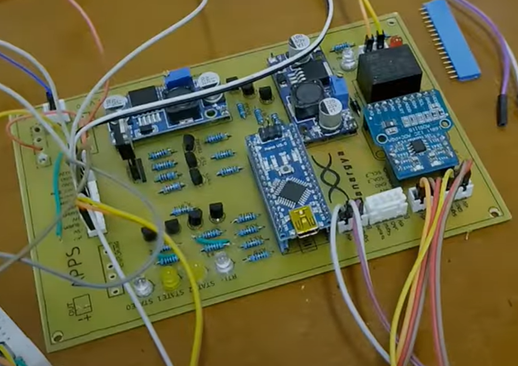
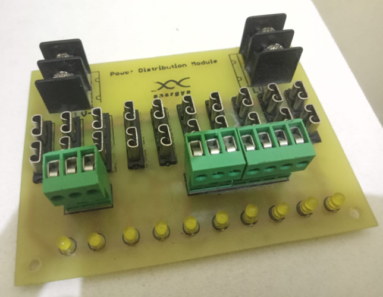

This is Faris's Portofolio & Finished Project Summary

Connect with me on

[ /muhammad-faris-zuhairi](https://www.linkedin.com/in/muhammad-faris-zuhairi/)

[ /faris.zuh](https://www.instagram.com/faris.zuh)

[ /fariszuh](https://github.com/fariszuh)

### Student Creativity Program by Kemdikbudristek
The Student Creativity Program (Program Kreativitas Mahasiswa/PKM) is a program of the Directorate General of Higher Education which was launched since 2001. 
PKM is a forum for students to study, explore and apply the knowledge they have learned in lectures to the wider community. 
In this program, my team getting funding and conducted research with lecture assitance. Here is my research:

1. Anargya Formula EV Mark 2.0 Safety Optimization on Brake System Plausibility Device and Shutdown Circuit

   (PKM Artikel Ilmiah - 2021) Supervisor: Dr.Yohanes, MSc 

   [Report](https://drive.google.com/file/d/1PhQYCqx3cNga5Bwk_2d478ZDWCQRFaYB/view?usp=sharing)

2. Burung Otomatis Minggat : Automatic Bird Repellent using Photovotaic 

    (PKM Penerapan Iptek - 2021) Supervisor: Heri Suryoatmojo, MT, PhD 

   [Report](https://drive.google.com/file/d/15jkfmGeAhg7mg9Sp4R30zkXuUmjkQNLm/view?usp=sharing)
   
3. Wireless Data Actuisition for Evaluating Concrete’s Heat of Hydration at Early Age

   (PKM Karsa Cipta - 2022) Supervisor: Faimun, MSc, PhD.

   [Report](https://drive.google.com/file/d/1brUnFBLFZpmZgZQtYiCr3HEU-Bk7r-g5/view?usp=sharing)

4. EV Battery’s Thermal Runaway Prediction with Data Actuision for Improving Driving Safety

    (PKM Karsa Cipta - 2022) Supervisor: Dr. Purwadi Agus Darwito, MSc

   [Report](https://drive.google.com/file/d/1ePBxKaZzkfORwJIkUyPjxptszIlHnDDB/view?usp=sharing)

### Control & Automation Lab

5. Egg Incubator using Embedded Temperature PID Controller and IoT (2022) [Report](https://drive.google.com/file/d/1-dwvOXYnXfp4yo8YYwyItHiJ5cvomVyj/view?usp=sharing)

6. Terco Motor & PLC Labwork Module for Basic Control System Practicum (2021-2022)

7. Bina Insani Vocational High School Pick and Place Module Including Ladder Program, Electrical Drawings, and Wiring (2023)

### Anargya EV Research
Our team getting fund support from university and sponsorship: PT.PJB, ABC Lithium, Toyota Indonesia, PT.INKA, etc.
I am responsible for handle Electro-Programming & Safety System Division task:
1. Safety System:

   
   
   Analog Board (Shutdown Circuit, Break System Plausibility Device, Insulation Monitoring Device)

   

3. Powering Device: designing power distribution module for our low voltage battery 14s3p (NMC 3.6V, 3.5Ah each)

4. Auxilliaries:

5. Wiring:
    
   

6. Enclosure: 

   