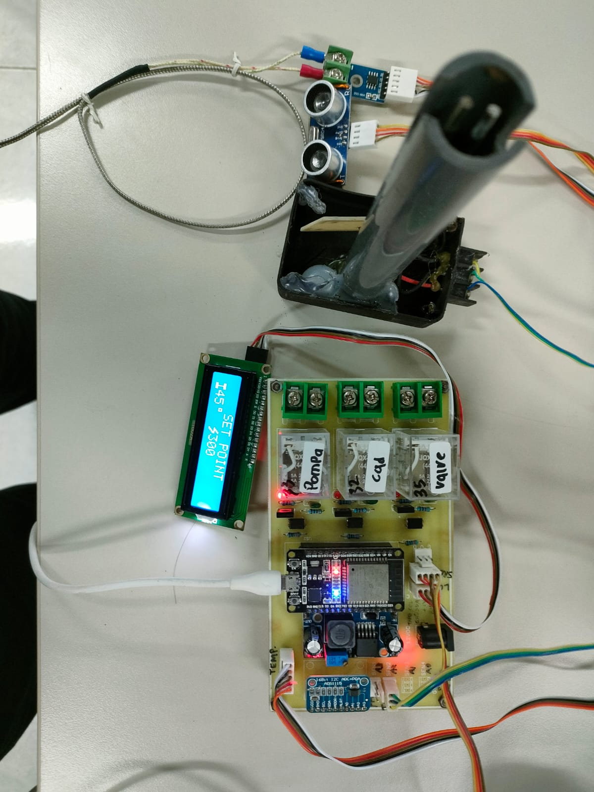
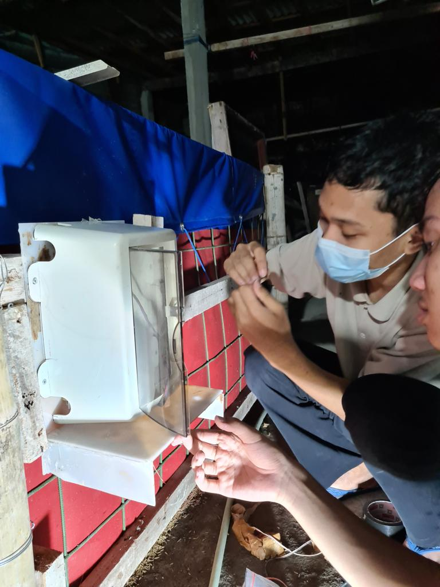
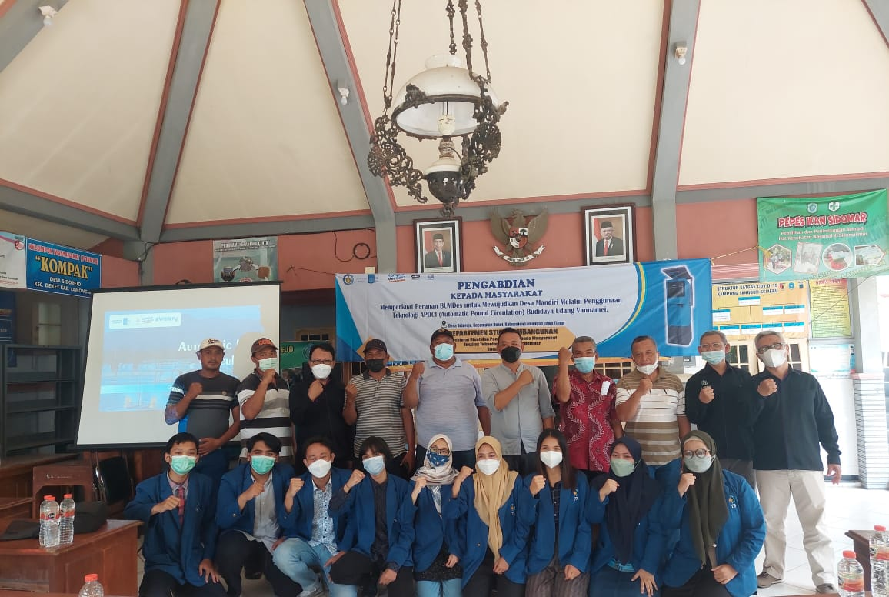

This is Faris's Portofolio & Finished Project Summary
## Working Experience
1. Electrical Eng

## Education
1. BEng, Institut Teknologi Sepuluh Nopember (2019-2023)

    Courses: Control System Design & Analysis, Adaptive Control, Intelligent Control, Automation System, Instrumentation, Embedded System, Robotics.
    
    GPA: 3.61/4.0 

    Thesis: Embedded Controller Design using Direct Neural Network for Level Control in PCT-100 Tank

## Organization
Head of Electro-Programming and Safety System, Anargya ITS EV Team (2021-2022)
* Organize 4 individuals, coordinating with stakeholders and external EV research company.
* Designing, simulating, assembly, and testing prototype, including BMS, Brake System Plausibility Device, shutdown system, Accelerator Pedal Position Sensor, and Tractive System Active Light according to FSAE & Formula Bharat 2022 rules.
* Designing Wiring Diagram and Cable Cutlist on RapidHarness
* Supervising FMEA, Engineering Design, Software Architecture, and Algorithm Integration documents.

## Event & Volunteering
1. Electra 

## My Documentation
### 1. Anargya EV

(![Prototype Apoci]/Portofolio/Apoci_PCB.jpg&#41;)


### 2. Internship on PT.PJB

### 3. Control & Automation Lab.

### 4. SPBKLU

### 5. Apoci Research
Automatic Pond Circulation is a prototype designed for monitoring and controlling water quality. 
Water quality measured by pH, salinity, turbidity, & temperature sensor. As those variable fluctuated dynamicly, drain valve and inlet pump circulate fresh water according user setpoint.
This project getting 2nd award in Identik-Kominfo, 3rd in Kolabpreneur 2021





## Header 2

> This is a blockquote following a header.
>
> When something is important enough, you do it even if the odds are not in your favor.

### Header 3

```js
// Javascript code with syntax highlighting.
var fun = function lang(l) {
  dateformat.i18n = require('./lang/' + l)
  return true;
}
```

```ruby
# Ruby code with syntax highlighting
GitHubPages::Dependencies.gems.each do |gem, version|
  s.add_dependency(gem, "= #{version}")
end
```

#### Header 4

*   This is an unordered list following a header.
*   This is an unordered list following a header.
*   This is an unordered list following a header.

##### Header 5

1.  This is an ordered list following a header.
2.  This is an ordered list following a header.
3.  This is an ordered list following a header.

###### Header 6

| head1        | head two          | three |
|:-------------|:------------------|:------|
| ok           | good swedish fish | nice  |
| out of stock | good and plenty   | nice  |
| ok           | good `oreos`      | hmm   |
| ok           | good `zoute` drop | yumm  |

### There's a horizontal rule below this.

* * *

### Here is an unordered list:

*   Item foo
*   Item bar
*   Item baz
*   Item zip

### And an ordered list:

1.  Item one
1.  Item two
1.  Item three
1.  Item four

### And a nested list:

- level 1 item
  - level 2 item
  - level 2 item
    - level 3 item
    - level 3 item
- level 1 item
  - level 2 item
  - level 2 item
  - level 2 item
- level 1 item
  - level 2 item
  - level 2 item
- level 1 item

### Small image


### Large image


### Definition lists can be used with HTML syntax.

<dl>
<dt>Name</dt>
<dd>Godzilla</dd>
<dt>Born</dt>
<dd>1952</dd>
<dt>Birthplace</dt>
<dd>Japan</dd>
<dt>Color</dt>
<dd>Green</dd>
</dl>

```
Long, single-line code blocks should not wrap. They should horizontally scroll if they are too long. This line should be long enough to demonstrate this.
```

```
The final element.
```
